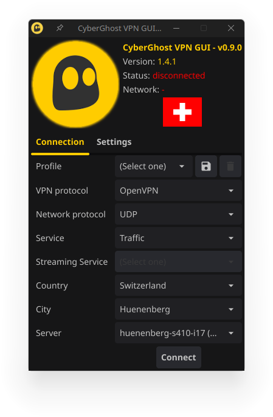
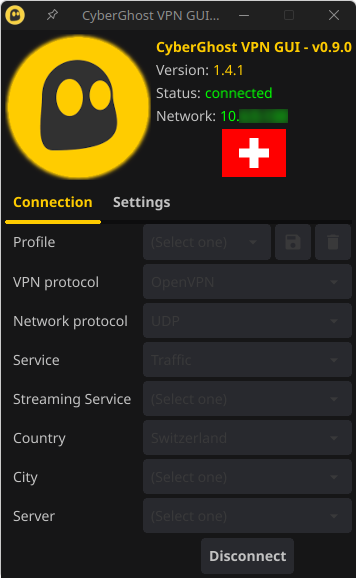
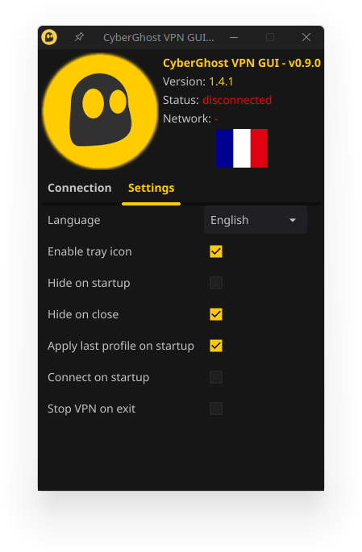

# Cyberghost VPN Linux GUI (Unofficial)

A simple and intuitive graphical user interface for managing Cyberghost VPN connections on Linux systems. It allows users to easily connect and disconnect from VPN servers, manage their VPN profiles, and monitor the status of their VPN connections.

## Features

* Connect and disconnect from Cyberghost VPN servers
* Manage VPN profiles (create, edit, delete)
* Monitor VPN connection status
* Simple and intuitive graphical user interface

## Screenshots

### Connection

 

### Settings



## Prerequisites

Before you can use Cyberghost VPN Linux GUI, you need to have the following prerequisites installed on your Linux system:

* Cyberghost VPN CLI (Official: https://www.cyberghostvpn.com/download/linux-vpn)
* Sudo

## Installation

To install Cyberghost VPN Linux GUI, you can use the release of follow these steps:

### 1. Clone the repository

```bash
git clone https://github.com/yourusername/cyberghost-vpn-linux-gui.git
```

### 2. Build the application using the build script
```bash
./build -l # Build for Linux.
```

# License

Cyberghost VPN Linux GUI is licensed under the MIT License. See the LICENSE file for more information.

# Disclaimer

Use this application at your own risk. The authors of this application are not responsible for any damage or loss caused by using this application.