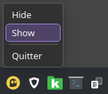
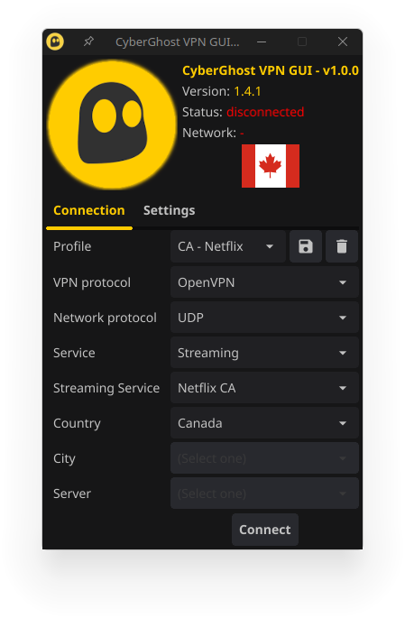
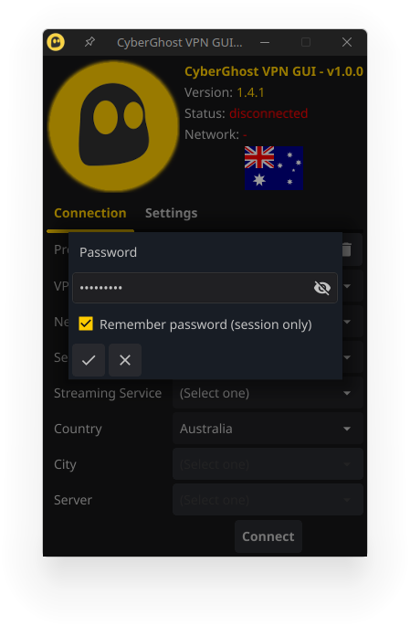
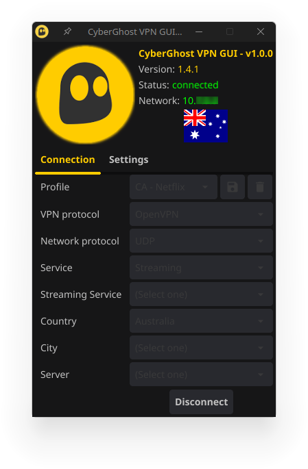
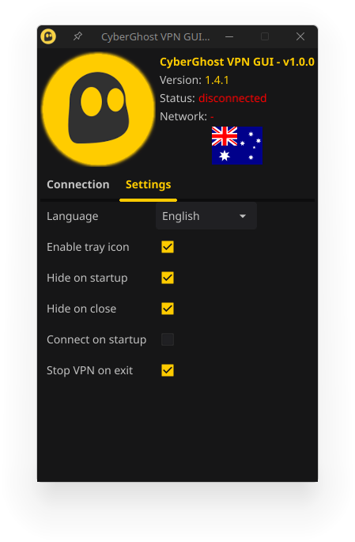

# Cyberghost VPN Linux GUI (Unofficial)

A simple and intuitive graphical user interface for managing Cyberghost VPN connections on Linux systems. It allows users to easily connect and disconnect from VPN servers, manage their VPN profiles, and monitor the status of their VPN connections.

It has been developed in Go using the Fyne.io graphical libraries.

## Features

* Connect and disconnect from Cyberghost VPN servers
* Manage VPN profiles (create, edit, delete)
* Monitor VPN connection status
* Simple and intuitive graphical user interface (multilingual)

## Screenshots

### Tray icon



### Connection

  

### Settings



## Prerequisites

Before you can use Cyberghost VPN Linux GUI, you need to have the following prerequisites installed on your Linux system:

* Cyberghost VPN CLI (Official: https://www.cyberghostvpn.com/download/linux-vpn)
* Sudo

## Installation

### Release

To install Cyberghost VPN Linux GUI, you can download the latest release available on github.

Or, for Arch Linux users, you can use AUR:
```bash
yay -S cyberghostvpn-gui # or paru, yaourt, etc.
```

### Build

#### 1. Prerequisites

Go 1.23 or higher is required to compile.

#### 2. Clone the repository

```bash
git clone https://github.com/picharly/cyberghostvpn-gui.git
```

#### 3. Install Go dependencies (check <i>go.mod</i> file)

```bash
cd cyberghostvpn-gui
go mod tidy
```

#### 4. Build the application

**Using build script**
```bash
./build -l # Build for Linux.
```

This script will generate an executable file into <i>{src}/bin</i> folder.

**Or manual build**
```bash
go build .
```

# License

Cyberghost VPN Linux GUI is licensed under the MIT License. See the LICENSE file for more information.

# Disclaimer

Use this application at your own risk. The authors of this application are not responsible for any damage or loss caused by using this application.

# Translations
This application is available in the following languages:

- Czech: Česká republika
- English: English
- French: Français
- German: Deutsch
- Italian: Italiano
- Japanese: 日本語
- Korean: 한국어
- Polish: Polski
- Portuguese: Português
- Romanian: Română
- Spanish: Español